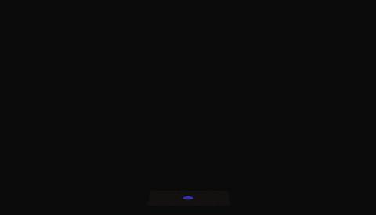
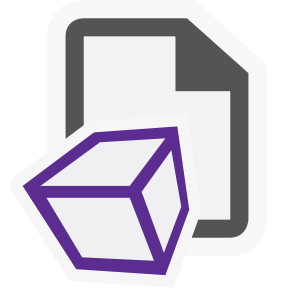
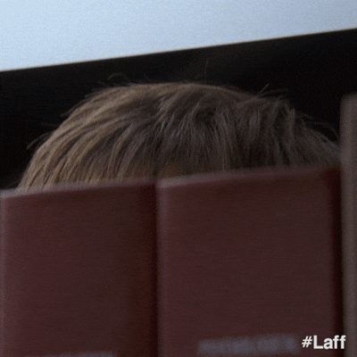

  
   
  
---
  
  

 

  

---

## About Me
I spend more time breaking shaders than writing them—**and that's how I learn**  
Usually just tweaking things until they look interesting (or break in a useful way)  
**If** it compiles on the first try, **something probably went wrong**  

---

## Tech Stack & Skills

  
### Shader Development

  
  
  
  

### Languages

### Tools & Platforms

### Currently Learning

---

## GitHub Stats

  
  

---

## Learning Journey

  

### Current Focus Areas
- **C++**: [Temmie](https://github.com/Temmielol) said I should learn C++, so I'm learning C++
- **Three.js**: 3D web rendering, need I say more?

---

## Fun Facts

- It all started with experimenting with over-rendering and eventually led me down the rabbit hole of HSV hue shift
- Before I knew it, I was writing GLSL on [Shadertoy](https://www.shadertoy.com) while learning from [BigWings](https://www.youtube.com/@TheArtofCodeIsCool)
- Powered by **coffee**, **curiosity**, and **far** too many late nights

 

---

  <h3> "Because of the nature of Moore's law, anything that an extremely clever graphics programmer can do at one point can be replicated by a merely competent programmer some number of years later." </h3>
  <h4>— John Carmack</h4>

---
## Let's Connect!

  

  

  

  

---

  

